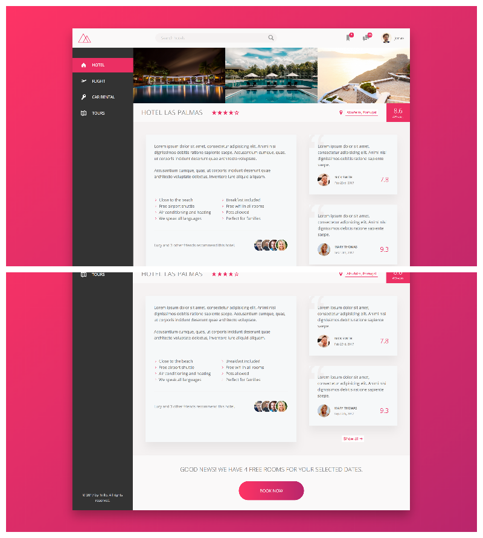

# Trillo
Project 2 in Jonas Schmedtmann's 'Advanced CSS & Sass' Udemy course. Introduces CSS flexbox and SVG icons
instead of icon fonts.

## Run
To start your Phoenix server:

  * Install dependencies with `mix deps.get`
  * Install Node.js dependencies with `cd assets && npm install`
  * Start Phoenix endpoint with `mix phx.server`

Now you can visit [`localhost:4000`](http://localhost:4000) from your browser.

Ready to run in production? Please [check our deployment guides](http://www.phoenixframework.org/docs/deployment).

## TODO
- [x] Add SVG icons (https://icomoon.io/app --> Entypo+)

## Screenshots

